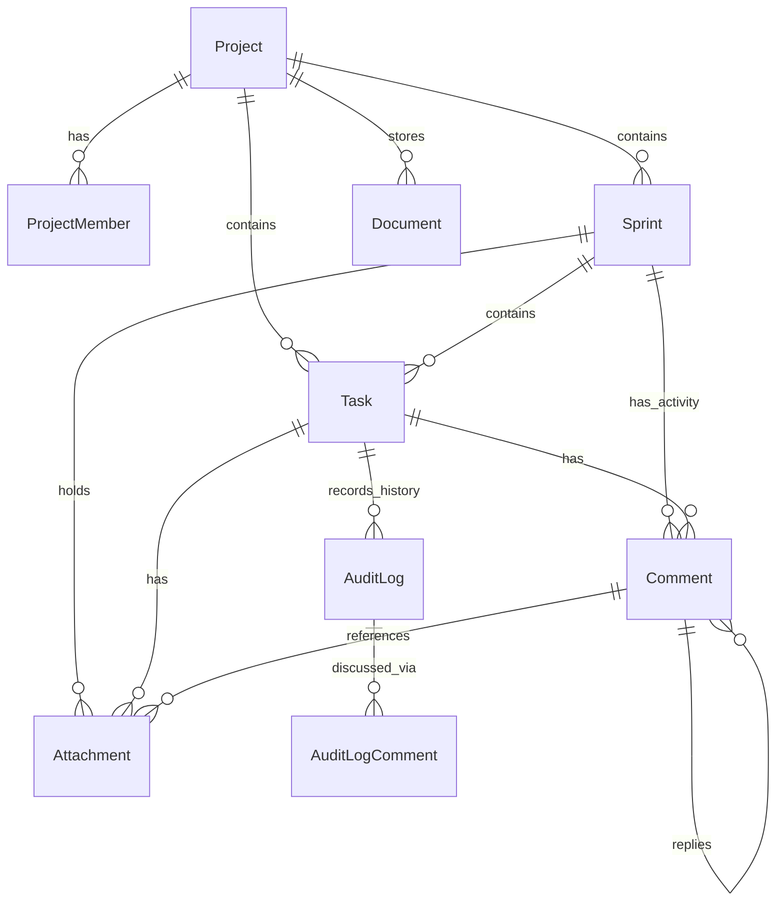

# Database & Schema

Zeta uses **Prisma** with **PostgreSQL**. The schema is optimized for deep relationships, contextual workspace partitioning, change auditing, and rich real-time collaboration.

## 📊 Core Models

### 1. Project
Root container representing a distinct team workspace.
- **Context Boundaries**: Projects completely partition members (`ProjectMember`), board sections (`BoardSection`), folders (`Folder`), wiki documents (`Document`), sprints, and tasks.

### 2. Sprint
A time-boxed work iteration that functions as a collaborative hub.
- **Sprint Activity**: Unlike basic boards, Zeta sprints support direct `comments` (`Comment[]`) and `attachments` (`Attachment[]`) at the sprint level, enabling team retrospective feeds and sprint-specific file folders.

### 3. Task
The core work ticket.
- **Subtask Hierarchy**: Employs the `TaskClosure` table for infinite-depth nested subtasks.
- **Rich Relations**: Tracks assignments (`TaskAssignment`), comments, attached files, linked documentation (`DocLink`), and its own historical record (`AuditLog[]`).

### 4. Attachment (Project/Context Storage Partitioning)
Contextual file storage system.
- **Storage Isolation**: Attachments map to specific `userId` uploaders, and connect to `taskId`, `sprintId`, or `commentId` to partition and secure files cleanly inside their respective workspace contexts.

### 5. Comment (Collaboration & Reallocations)
Threaded discussion engine.
- **Sprint & Task Contexts**: Comments can belong to either a `Task` or a `Sprint`, allowing for both ticket-level and sprint retrospective-level boards.
- **Reallocation Logger**: Supports `isReallocationLog: Boolean` flag to automatically mark and format system-generated history adjustments.

### 6. AuditLog & AuditLogComment (Audit Discussion Threads)
Zeta's historical change logs.
- **Commentable Audits**: Every metadata change is recorded as an `AuditLog`. Zeta allows team members to comment directly on specific changes via `AuditLogComment[]` to discuss why an estimate, assignee, or date was adjusted.

## 🔗 Relationships Diagram (Conceptual)

