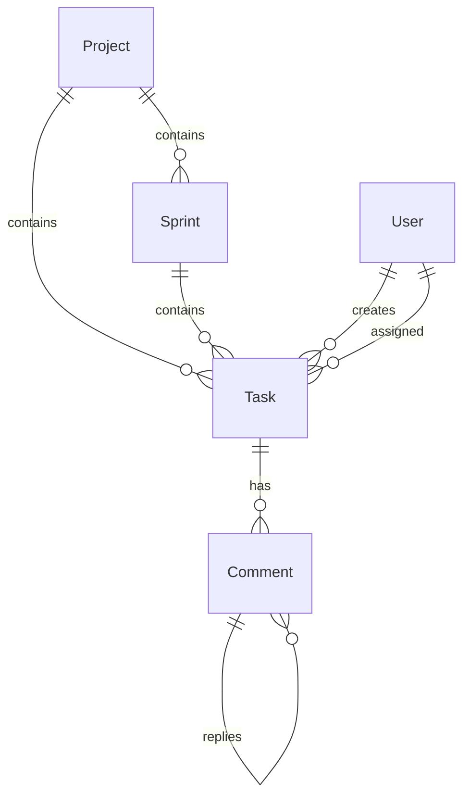

# Database & Schema

Zeta uses **Prisma** with **PostgreSQL**. The schema is designed for deep relationships and efficient hierarchy querying.

## 📊 Core Models

### 1. Project
Root container for all sprints and tasks.
- `boardSections`: Defines the Kanban columns (e.g., TODO, IN_PROGRESS, DONE).

### 2. Sprint
Time-boxed iteration containing tasks.
- `startDate` / `endDate`: Used to determine status (Planned/Active/Completed).
- `tasks`: Relation to Task model.

### 3. Task
The primary unit of work.
- `status`: Matches `boardSections` names.
- `points`: Fibonacci complexity (1, 2, 3, 5, 8, 13).
- **Reporter**: The user who created the task or is designated as the primary stakeholder. Represented by `reporterId` and `reporter` relation in the schema.
- `assigneeId`: The person working on it.
- `githubUrl`: Persistent link to a GitHub Commit/PR.
- `repoName` / `branchName`: Parsed metadata from the URL.

### 4. TaskClosure
Implements the **Closure Table** pattern for subtasks.
- `ancestorId`: Link to parent/ancestor task.
- `descendantId`: Link to child/descendant task.
- `depth`: Distance in the tree.

### 5. Comment
Threaded discussion system.
- `parentId`: Recursive link to support nested replies.
- `content`: Supports text and potential markdown.
- `userId`: Link to the author.

## 🔗 Relationships Diagram (Conceptual)

